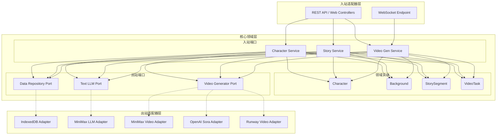
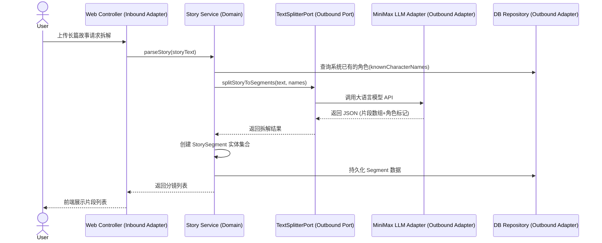
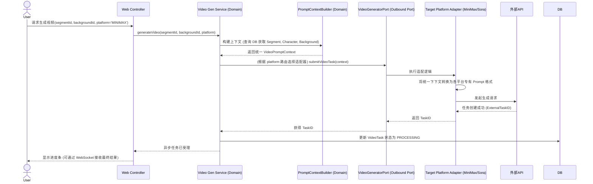

# AI短视频创作平台 - 系统设计文档 (SDD)

## 1. 架构总览 (Architecture Overview)

### 1.1 六边形架构 (Hexagonal Architecture)
本系统采用**六边形架构（端口与适配器模式）**，旨在将核心业务逻辑与外部框架、数据库及第三方 AI 平台完全解耦。

- **核心领域层 (Domain)**：系统的核心，包含领域实体、业务规则和用例。它不依赖任何外部技术栈。
- **端口 (Ports)**：
  - **入站端口 (Inbound / Primary Ports)**：定义了外部系统或前端可以调用的业务用例接口。
  - **出站端口 (Outbound / Secondary Ports)**：定义了核心业务需要外部服务（如数据库存储、第三方大模型生成）时所依赖的接口。
- **适配器 (Adapters)**：
  - **入站适配器 (Inbound / Primary Adapters)**：如 RESTful Controllers、WebSocket 处理器，负责将外部请求转换为对入站端口的调用。
  - **出站适配器 (Outbound / Secondary Adapters)**：如 IndexedDB Repositories、`MiniMaxVideoAdapter`、`SoraVideoAdapter`，负责实现出站端口，与外部基础设施或本地存储交互。

### 1.2 系统架构图


---

## 2. 核心领域模型 (Domain Model)

### 2.1 实体 (Entities)
1. **`Character` (角色)**
   - 属性：`characterId`, `name`, `appearancePrompt` (外貌描述), `personalityPrompt` (性格描述), `referenceImageUrl` (参考图链接)。
2. **`Background` (故事背景)**
   - 属性：`backgroundId`, `name`, `environmentPrompt` (环境描述), `referenceImageUrl` (参考图链接)。
3. **`Story` (故事)**
   - 属性：`storyId`, `originalText` (原文本), `status` (状态：未拆分/已拆分)。
4. **`StorySegment` (分镜片段)**
   - 属性：`segmentId`, `storyId`, `sequenceOrder` (序号), `content` (片段情节), `mentionedCharacters` (片段中出现的角色集合), `selectedBackgroundId` (选定的背景)。
5. **`VideoTask` (视频生成任务)**
   - 属性：`taskId`, `segmentId`, `targetPlatform` (目标平台,如 Minimax), `status` (PENDING, PROCESSING, SUCCESS, FAILED), `videoUrl` (生成结果), `errorMessage`。

---

## 3. 核心端口与适配器设计 (Ports & Adapters)

### 3.1 视频生成出站端口 (Outbound Port)
定义一个统一的视频生成接口，供业务逻辑层调用，从而隔绝不同底层大模型的差异。

```typescript
// 统一的上下文参数对象
interface VideoPromptContext {
    actionContent: string;           // 片段的动作/情节描述
    characters: CharacterInfo[];     // 出场角色设定及参考图
    background: BackgroundInfo;      // 背景设定及参考图
    videoStyle?: string;             // 视频风格模板 (Agent Template)
}

// 视频生成核心出站端口
interface VideoGeneratorPort {
    // 发起生成任务，返回第三方平台的任务ID
    submitVideoTask(context: VideoPromptContext): Promise<string>;
    
    // 轮询或查询任务状态
    queryTaskStatus(externalTaskId: string): Promise<VideoTaskResult>;
}
```

### 3.2 视频生成出站适配器 (Outbound Adapters)
针对不同平台实现上述端口：

- **`MiniMaxVideoAdapter`**:
  - 实现 `submitVideoTask`：将 `VideoPromptContext` 按照 MiniMax API 规范格式化（例如拼接 Prompt：“[背景描述], [角色描述], [动作描述]”），并调用 MiniMax API，处理鉴权和参数转换。
- **`SoraVideoAdapter`**:
  - 实现 `submitVideoTask`：按照 OpenAI 的接口要求化参数和参考图。

### 3.3 文本拆解出站端口 (LLM Port)
```typescript
interface TextSplitterPort {
    // 拆解故事文本，返回分段数组，并识别其中出现的角色名
    splitStoryToSegments(text: string, knownCharacterNames: string[]): Promise<SegmentDraft[]>;
}
```

---

## 4. 核心业务流程时序图

### 4.1 故事片段拆分与角色绑定


### 4.2 视频片段生成 (多平台路由)


---

## 5. 上下文构建机制 (PromptContextBuilder)

为了保证视频大模型的高成片率，**PromptContextBuilder** 组件是领域层的核心工具。它负责执行 **统一 Prompt 工程优化**。
当用户点击“生成视频”时：
1. **聚合数据**：提取 `StorySegment` 的文本，根据 `selectedBackgroundId` 取出环境 Prompt 和参考图，根据 `mentionedCharacters` 提取出场角色的形象 Prompt 和参考图。
2. **文本结构化翻译**：调用内部的文本模型，将具有文学色彩的片段（如“他仰天长啸”）翻译为具有客观镜头感的画面描述语言（如“男人脸部特写，张嘴怒吼，仰视镜头”）。
3. **组合**：将所有素材组合封装到标准的 `VideoPromptContext` 对象中。
4. **适配**：最终交由底层 Adapter 时，Adapter 只需根据具体的平台参数字段（如是否支持 Image-to-Video，是否支持 Prompt 分段传入）去解析 `VideoPromptContext` 即可。

---

## 6. 技术栈建议 (Local-First 纯前端架构)
由于指定了使用 IndexedDB 作为数据库，本系统实际上采用的是**纯前端架构 (Local-First Architecture)**。所谓的“后端”业务逻辑（Domain Layer 和 Adapters）将完全运行在浏览器端。
- **核心逻辑开发语言**：TypeScript (借助强类型保证六边形架构中 Ports 接口定义的严谨性)。
- **本地数据库**：IndexedDB (推荐使用 `Dexie.js` 或 `idb` 库作为 IndexedDB 的适配器，管理各类资产数据)。
- **外部通信**：Axios (通过 Axios 封装 API Adapter，统一处理发往 MiniMax、Sora 等第三方大模型平台的 HTTP 接口请求)。
